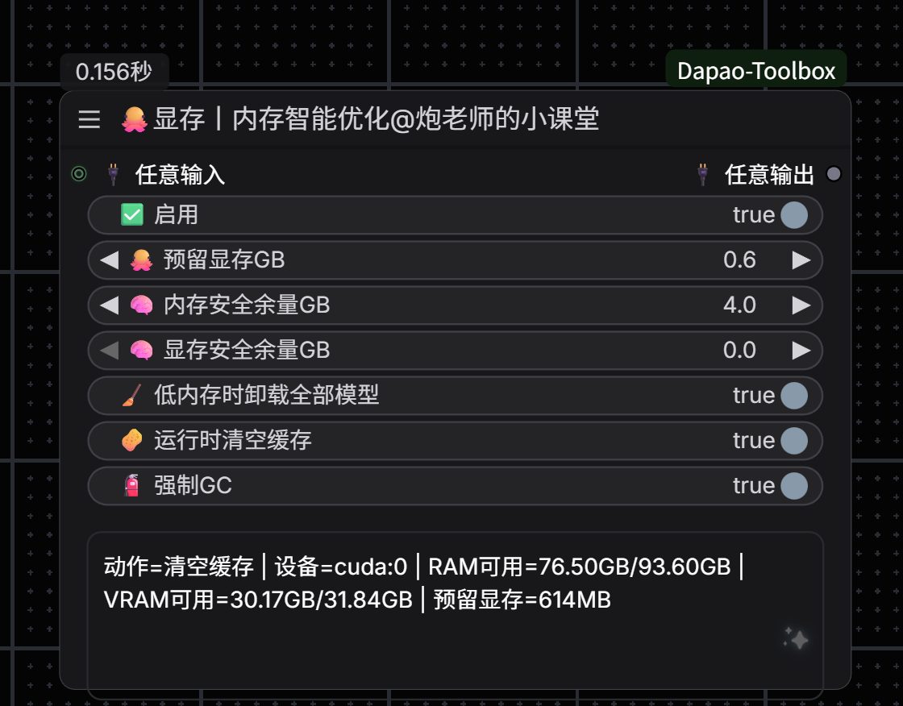

# 🤖 Dapao-Toolbox

ComfyUI自定义节点工具箱 - 由炮老师的小课堂出品

## 📦 节点列表
- ✨增加显存内存自动优化节点，运行之前先运行一次此节点，能有效释放显存内存，避免后续节点运行失败。

参考原项目：https://github.com/Windecay/ComfyUI-ReservedVRAM?tab=readme-ov-file
### 🔢 多图片开关节点

**功能特点：**
- ✨ **智能动态输入** - 默认2个输入，连接后自动增加新输入（最多20个）
- 🎯 **编号选择** - 使用编号快速切换要输出的图片
- ⏭️ **自动跳过** - 可选择自动跳过空图片
- 🔄 **循环模式** - 索引超出范围时自动循环
- 🎨 **美化界面** - 使用emoji图标美化参数显示
- 📊 **详细信息** - 输出当前选择、总图片数等详细信息

**输入参数：**
- 🎯 编号 (1-20) - 选择要输出的图片编号（从1开始）
- ⏭️ 跳过空图片 - 启用后自动跳过未连接的图片输入
- 🔄 循环模式 - 启用后索引会循环回到第一张
- image1-20 - 动态图片输入端口（自动扩展）

**动态输入工作原理：**
1. 节点初始显示2个输入端口（image1, image2）
2. 当所有输入都连接后，自动添加新的输入端口
3. 最多支持20个输入端口（image1-image20）
4. 断开连接后，多余的空输入会自动清理
5. 编号从1开始，直接对应输入端口名称

**输出参数：**
- 🖼️ 图像 - 选中的图片
- ℹ️ 信息 - 详细的状态信息
- 🔢 索引 - 实际输出的图片编号
- 📊 总数 - 当前连接的图片总数

**使用场景：**
1. 批量图片处理时快速切换不同的输入图片
2. 工作流中需要在多个图片之间进行选择
3. 测试不同图片的处理效果

### 📐 图片排列节点

**功能特点：**
- 🎯 **四种排列方向** - 左右、上下、左上、右上四种排列方式
- 📁 **文件夹输入** - 支持从文件夹批量加载图片
- 📐 **基准图尺寸控制** - 默认自动或自定义最长边
- 📊 **智能布局** - 支持自动、固定列数、固定行数三种模式
- 🎨 **多种缩放** - 适应、裁剪、拉伸三种缩放模式
- 🌈 **自定义样式** - 可设置背景颜色、边框等

**输入参数：**
- 📸 基准图片 - 作为主图显示
- 📁 使用文件夹 - 启用后使用文件夹路径，禁用则使用批次图片输入端口
- 📂 图片文件夹路径 - 文件夹路径（需启用"使用文件夹"开关）
- 🎯 排列方向 - 左右排列/上下排列/左上排列/右上排列
- 📐 基准图尺寸模式 - 默认/自定义最长边
- 📏 基准图最长边 (256-2048) - 自定义模式下的最长边像素
- 📐 布局模式 - 自动/固定列数/固定行数
- 📊 列数 (1-10) - 网格列数（固定列数模式）
- 📏 行数 (1-10) - 网格行数（固定行数模式）
- 🔍 小图尺寸 (64-1024) - 批次图片尺寸
- 📏 间距 (0-100) - 图片间距
- 🎨 缩放模式 - 适应/裁剪/拉伸
- 🌈 背景颜色 - 白色/黑色/灰色/透明
- 🖼️ 批次图片（可选）- 从输入端口获取批次图片（需禁用"使用文件夹"开关）
- 🔢 最大批次数 (1-100) - 最多显示的批次图片数
- 🖼️ 添加边框 - 是否添加边框
- 🎨 边框颜色 - 黑色/白色/灰色/红色/蓝色
- 📏 边框宽度 (1-10) - 边框宽度

**输出参数：**
- 🖼️ 排列图像 - 排列后的完整图像
- ℹ️ 布局信息 - 详细的布局参数信息
- 📊 总图片数 - 包含的图片总数
- 📐 网格尺寸 - 网格的行列数（编码值）

**排列方向说明：**
1. **左右排列** - 基准图在左侧，批次图在右侧网格排列
2. **上下排列** - 基准图在上方，批次图在下方网格排列
3. **左上排列** - 基准图在左上角，批次图在右侧网格排列（顶部对齐）
4. **右上排列** - 基准图在右上角，批次图在左侧网格排列（顶部对齐）

**基准图尺寸模式说明：**
1. **默认模式** - 根据排列方向自动计算基准图尺寸
   - 左右排列：基准图高度与批次图网格相同
   - 上下排列：基准图宽度与批次图网格相同
2. **自定义最长边** - 指定基准图最长边的像素值，保持宽高比

**布局模式说明：**
1. **自动模式** - 根据图片数量自动计算最优行列数（接近正方形）
2. **固定列数** - 指定列数，行数自动计算
3. **固定行数** - 指定行数，列数自动计算

**缩放模式说明：**
1. **适应模式**（推荐）- 保持比例，不裁剪，添加背景填充
2. **裁剪模式** - 居中裁剪填充正方形，可能裁掉部分内容
3. **拉伸模式** - 直接拉伸到正方形，可能变形

**批次图片来源（通过开关控制）：**
1. **禁用"使用文件夹"** - 从"批次图片"输入端口获取图片
   - 必须连接批次图片输入端口
   - 文件夹路径参数不生效
2. **启用"使用文件夹"** - 从指定文件夹加载图片
   - 必须填写有效的文件夹路径
   - 批次图片输入端口不生效
   - 支持格式：jpg、png、bmp、webp、tiff
3. **开关逻辑**：两种模式互斥，只能选择其中一种

**使用场景：**
1. 对比展示：原图与多个处理结果对比
2. 批量预览：主图配多张缩略图
3. 工作流展示：展示图片处理的多个步骤
4. 效果对比：不同参数生成的结果对比
5. 文件夹批量：从文件夹加载大量图片进行排列

---

### 📦 制作图像批次节点

**功能特点：**
- ✨ **智能动态输入** - 默认2个输入，连接后自动增加新输入（最多20个）
- 🔗 **批次合并** - 将多个单独图像合并成一个批次
- ⚡ **自动跳过** - 自动跳过未连接的输入端口
- 📊 **数量统计** - 输出批次中的图像数量

**输入参数：**
- 📸 图像1-20 - 动态图像输入端口（自动扩展）

**动态输入工作原理：**
1. 节点初始显示2个输入端口（图像1, 图像2）
2. 当所有输入都连接后，自动添加新的输入端口
3. 最多支持20个输入端口（图像1-图像20）
4. 断开连接后，多余的空输入会自动清理

**输出参数：**
- 🖼️ 图像批次 - 合并后的图像批次
- 📊 图像数量 - 批次中包含的图像总数

**功能说明：**
此节点将多个单独的图像合并成一个批次（batch）。在ComfyUI中，批次是指多张图像在同一个tensor中的集合，可以被后续节点批量处理。

**使用场景：**
1. 批量处理：将多张图像合并后统一处理
2. 动画生成：将多帧图像合并成批次用于视频生成
3. 对比测试：将不同版本的图像合并后统一评估
4. 工作流优化：减少重复节点，提高处理效率

**技术说明：**
- 输入图像会沿着batch维度（第0维）连接
- 所有输入图像的尺寸和通道数必须相同
- 输出的批次可以被支持批处理的节点使用

---

### 📐 按宽高比缩放节点

**功能特点：**
- 📐 **多种预设比例** - 支持16:9, 4:3, 1:1, 9:16等常用比例
- 🎨 **适应模式** - 支持包含(Letterbox)、裁剪(Crop)、拉伸(Stretch)
- 🔒 **边长锁定** - 可锁定宽度、高度、最长边或最短边
- 🔢 **尺寸倍数** - 确保输出尺寸符合倍数要求（如8倍）
- 🌈 **背景颜色** - 包含模式下可自定义填充背景色

### 🖌️ 按方向外补画板节点

**功能特点：**
- ↔️ **方向外补** - 支持上、下、左、右四个方向独立设置
- 📏 **灵活单位** - 支持像素值或百分比单位
- 🎨 **丰富配色** - 支持预设颜色及自定义HEX颜色填充
- 🔢 **整除调整** - 自动调整尺寸以满足整除要求
- 😷 **遮罩处理** - 自动生成遮罩并支持边缘羽化

---

## 🎨 设计规范

本项目所有节点遵循以下设计规范：
- 节点分类：`🤖Dapao-Toolbox`
- 显示名称：`[节点名称] [emoji]@炮老师的小课堂`
- 参数美化：使用emoji图标美化参数名称
- 详细注释：代码包含完整的中文注释，方便学习

## 📝 更新日志

### v1.4.0 (2025-11-28)
- ✅ 新增按方向外补画板节点
- ✅ 支持上下左右独立外补
- ✅ 支持像素/百分比单位及自定义填充色
- ✅ 新增按宽高比缩放节点
- ✅ 支持多种预设比例和适应模式

### v1.3.0 (2025-11-22)
- ✅ 新增制作图像批次节点
- ✅ 支持最多20张图像输入
- ✅ 自动合并成批次并统计数量
- ✅ 美化的参数界面

### v1.2.1 (2025-11-22)
- ✅ 优化文件夹输入逻辑
- ✅ 新增"使用文件夹"开关，明确控制图片来源
- ✅ 文件夹路径参数移至排列方向上方
- ✅ 两种模式互斥：输入端口 vs 文件夹路径

### v1.2.0 (2025-11-22)
- ✅ 图片排列节点增强
- ✅ 新增四种排列方向（左右/上下/左上/右上）
- ✅ 新增文件夹输入功能，支持批量加载图片
- ✅ 新增基准图尺寸控制（默认/自定义最长边）
- ✅ 批次图片支持从输入端口或文件夹获取

### v1.1.0 (2025-11-22)
- ✅ 添加图片排列节点
- ✅ 支持基准图+批次图网格布局
- ✅ 三种布局模式（自动/固定列数/固定行数）
- ✅ 三种缩放模式（适应/裁剪/拉伸）
- ✅ 可自定义背景颜色和边框

### v1.0.0 (2025-11-22)
- ✅ 初始版本发布
- ✅ 添加多图片开关节点
- ✅ 支持动态输入（最多20张图片）
- ✅ 美化的参数界面
- ✅ 智能跳过和循环模式

## 👨‍🏫 关于作者

!
## 📄 许可证

本项目采用 MIT 许可证
# Dapao-Toolbox
